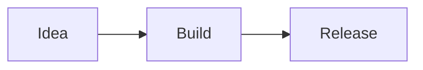

# Mermaid diagrams

Mermaid is Skald's second built-in extension and the first generic fenced-code renderer. Diagrams
use standard Markdown rather than a Skald-only component:

````markdown

````

Open **+ insert** (or press `⌘I` / `Ctrl+I`) and choose **Mermaid diagram** to insert a starter
flowchart. Live and Read modes render
the diagram; Source mode and other Markdown applications retain the original fence. Unsupported
fence languages continue to render as ordinary code blocks.

Rendering is entirely local. Mermaid receives no vault, filesystem, authentication, or network
capability. Its strict security mode is combined with a final SVG sanitization pass before the
result enters the page. Invalid syntax produces an inline error with the relevant Mermaid line
when the parser reports one, plus a collapsible copy of the complete source.

The diagram toolbar supports zooming and the viewport scrolls in both directions for panning.
Copy SVG puts the sanitized source on the clipboard. SVG and PNG export use browser-native blobs;
PNG is rasterized locally against the current Skald surface color.

Mobile currently preserves and displays the source as an ordinary fenced code block. The manifest
therefore declares desktop support only until a native or safely isolated mobile renderer ships.
